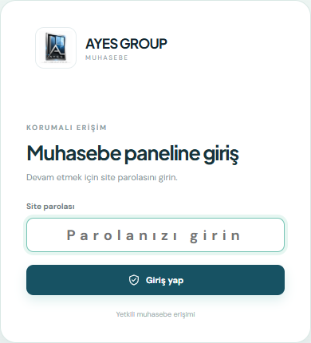
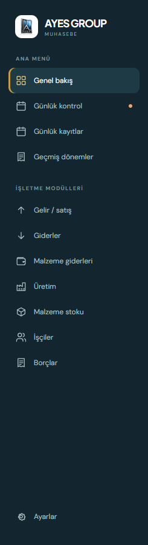

# AYES GROUP — Muhasebe Paneli

PVC pencere ve kapı sistemleri üreten işletmeler için tek ekranlı **muhasebe ve operasyon takip uygulaması**. Gelir, gider, üretim, stok, personel ve borçlar; günlük kontrol ve geçmiş dönem raporlarıyla birlikte tek panelde yönetilir.

## Özellikler

| Bölüm | Açıklama |
|---|---|
| Genel bakış | Metrik kartları, gelir–gider grafiği (7/14/30 gün) ve son satışlar |
| Günlük kontrol | Kontrol skoru, tamamlanan/bekleyen adımlar ve gün özeti |
| Günlük kayıtlar | Seçili ayın her günü için otomatik oluşan gün raporları |
| Gelir / satış | Müşteri, malzeme, adet, ödeme tipi ve fatura takibi |
| Giderler | Kategori, açıklama, çalışan ödemesi ve ödeme kanalı takibi |
| Malzeme giderleri | Ürün cinsi, renk, paket ve boy bilgisiyle malzeme alımları |
| Üretim | Palet, adet, fire ve hammadde kullanım takibi |
| Malzeme stoku | Stok bakiyeleri, düşük stok uyarıları, satışta otomatik stok düşümü (opsiyonel) |
| İşçiler | Maaş, avans, devamsızlık, bakiye ve aylara göre ödeme detayı |
| Borçlar | **Alınan / verilen** ayrımı, ödeme–tahsilat akışı, işlem geçmişi ve ilerleme çubuğu |
| Geçmiş dönemler | Yalnızca kapanmış ayların toplu sonuçları ve ay sonu arşivi |
| Raporlar | Tek tıkla PDF rapor (aktif modül veya tüm modüller) |
| Yedekleme | Tüm verinin JSON yedeğini indirme / içe aktarma |

## Teknolojiler

- **React** + **Vite** — kullanıcı arayüzü ve derleme
- **Supabase** (PostgreSQL + Auth + REST) — bulut senkronizasyonu
- **jsPDF + autotable** — PDF rapor üretimi
- **localStorage** — çevrimdışı yerel yedek

## Hızlı Başlangıç

Gereksinim: **Node.js 18+** ve npm.

```bash
git clone https://github.com/arslnysuf/muhasebe.git
cd muhasebe
npm install
```

Ortam dosyasını oluşturun (Windows'ta `copy .env.example .env`):

```bash
cp .env.example .env
```

`.env` dosyasını kendi bilgilerinizle doldurun, ardından geliştirme sunucusunu başlatın:

```bash
npm run dev
```

| Komut | Açıklama |
|---|---|
| `npm run dev` | Geliştirme sunucusu (hot reload) |
| `npm run build` | Üretim derlemesi (`dist/` klasörüne) |
| `npm run preview` | Derlenen çıktıyı yerel olarak önizleme |

## Ortam Değişkenleri

| Değişken | Açıklama |
|---|---|
| `VITE_SUPABASE_URL` | Supabase proje URL'si |
| `VITE_SUPABASE_PUBLISHABLE_KEY` | Supabase publishable (anon) anahtarı |
| `VITE_SITE_PASSWORD` | Panel giriş parolası |

Supabase bilgileri girilmezse uygulama **yerel modda** çalışır; veriler yalnızca tarayıcıda saklanır.

## Proje Yapısı

```text
├── index.html              # HTML giriş noktası
├── public/
│   ├── ayes-logo.png       # Uygulama logosu
│   └── fonts/              # PDF raporlarında kullanılan fontlar
├── src/
│   ├── main.jsx            # Tüm uygulama (görünümler, modallar, raporlar)
│   ├── styles.css          # Tasarım sistemi ve responsive stiller
│   └── supabaseClient.js   # Supabase istemci yapılandırması
└── docs/                   # Ekran görüntüleri
```

## Veri ve Senkronizasyon

- Tüm muhasebe verisi Supabase'te `accounting_state` tablosundaki `main` satırında tek bir JSON olarak tutulur.
- Değişiklikler ~350 ms gecikmeyle otomatik senkronize edilir; bağlantı koparsa uygulama yerel yedekle çalışmaya devam eder.
- Veritabanı erişimi yalnızca **giriş yapmış kullanıcılara** açıktır (anonim erişim kapalıdır).
- Uygulama tek işletme (`AYES GROUP`) için yapılandırılmıştır.

## Ekran Görüntüleri

| Giriş | Panel |
|---|---|
|  |  |

## Dağıtım

Uygulama statik bir sitedir; `npm run build` çıktısı olan `dist/` klasörü Vercel, Netlify veya benzeri bir platforma doğrudan yayınlanabilir. Yayınlanan ortamda yukarıdaki ortam değişkenlerinin tanımlı olması yeterlidir.

## Güvenlik Notları

- `.env` dosyası repoya **eklenmez** (`.gitignore` ile korunur); örnek şablon için `.env.example` dosyasına bakın.
- Supabase tarafında `anon` rolüne tablo yetkisi verilmemeli; erişim `authenticated` rolü ve RLS politikalarıyla sınırlandırılmalıdır.
